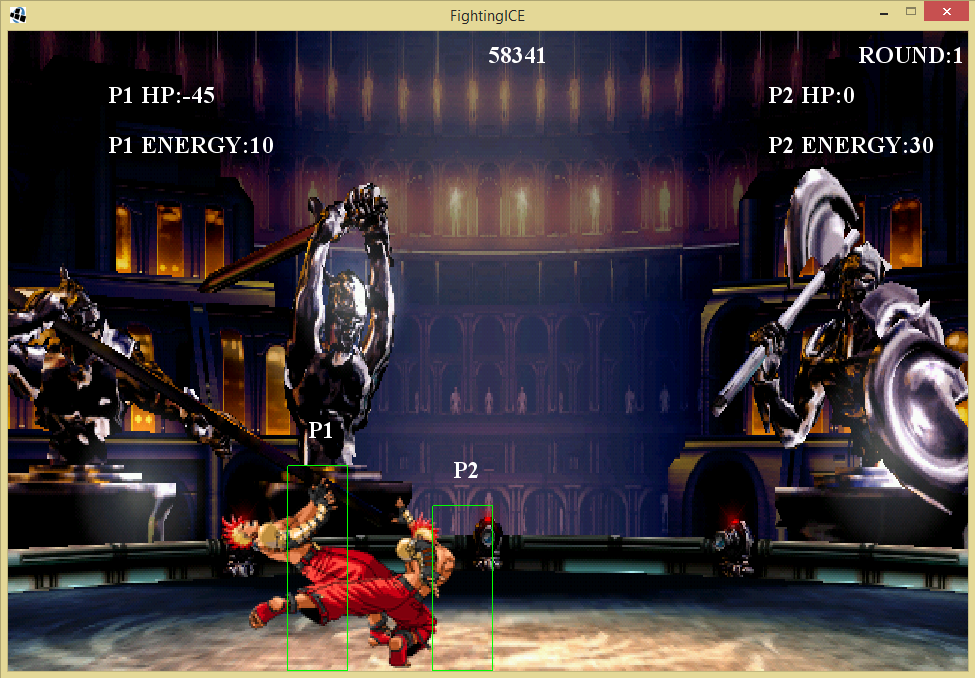

# HAL

In this project, an alternative architecture is proposed for the <a href="http://www.ice.ci.ritsumei.ac.jp/~ftgaic/">Fighting ICE</a> competition which combines two of the most popular previous architectures reflex and learning based as subsystems. In this project I present a hybrid based architecture which combines two subsystems one reactive and one proactive and combines them into a single agent. A simple reflex agent is used to build in some expert knowledge and k nearest neighbor is used to predict attacks based on location. The sub-system is modeled as a vertically layered one pass architecture. This allows for the combination of different agent architectures at each layer and to choose the optimal action based on the perception system.

The controller in it's current form is quite successful and has been able to beat a number of the controllers from the previous year. Further information about the design of the system can be seen in the report. 

Agent 		|Round 1|Round 2|Round 3|Average
------------|-------|-------|-------|-------
T3C   		|418 	|757 	|726 	|634
ATTeam2 	|478 	|415 	|518 	|470
DragonKing3C|447 	|493 	|578 	|506

This table shows the results against the top 3 controllers from last year with a score above 500 indicating a win. 